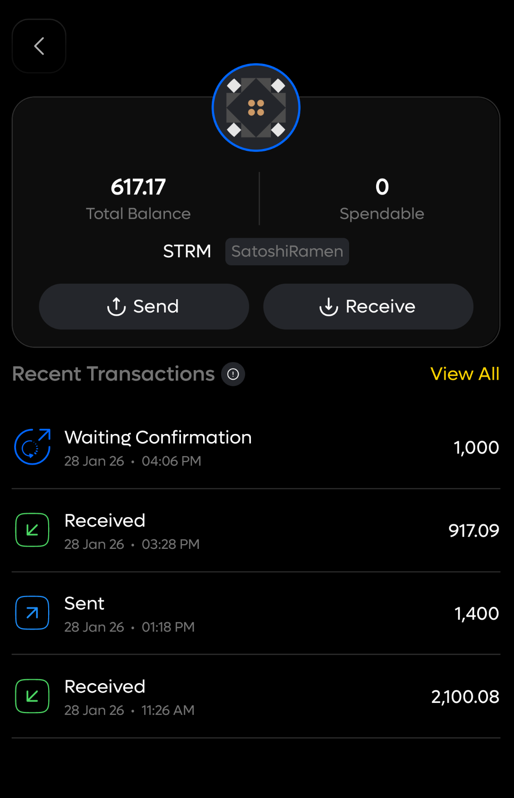

# Getting started

### How BTC → RGB Transfers Work

When transferring BTC from the Bitcoin network to RGB, you send BTC to a Utexo-generated deposit address and receive an equivalent BTC-backed asset on RGB. You approve the BTC send in your Bitcoin wallet, and you use an RGB invoice to specify the recipient on the RGB side.


Requirements before you start

* Tribe Wallet (mobile app)




### Enter the transfer details

1. In **You send**, enter the amount of RGB tokens to receive.
2. Click **Swap**.
3. In Tribe Wallet:
   1. Open **Other assets** (**Step 3**).
   2. Tap the **+** icon (**Step 4**).
   3. Tap **Receive Asset** (**Step 5**).
   4. Generate an invoice (**Step 6**).
   5. Select a **blinded** invoice, then copy it.
4. Paste the invoice into the **RGB invoice** field in Utexo (**Step 8**).
5. Click **Confirm**.
6. Copy the BTC payment address and amount shown by Utexo (**Step 9**).

<figure><figcaption>
Step 1: Select the RGB token to get a quote
</figcaption></figure> <figure><figcaption>
Step 2: App requires RGB invoice to be entered
</figcaption></figure>

<figure><figcaption>
Step 3: Open "Other assets"
</figcaption></figure> <figure><figcaption>
Step 4: Tap the plus (+) icon to add an asset
</figcaption></figure> <figure><figcaption>
Step 5: Tap "Receive Asset"
</figcaption></figure> <figure><figcaption>
Step 6: Tap "Generate Invoice"
</figcaption></figure> <figure><figcaption>
Step 7: Copy the generated invoice or scan the QR code
</figcaption></figure>

<figure><figcaption>
Step 8: Paste the generated invoice into Utexo
</figcaption></figure> <figure><figcaption>
Step 9: Copy the BTC payment address
</figcaption></figure>




### Pay BTC to receive RGB

1. In your BTC wallet, scan the QR code or paste the recipient address.
2. If you scan the QR code, the amount is filled in automatically.
3. Paste the payment address (**Step 10**), then **Swipe to broadcast** (**Step 11**).

<figure><figcaption>
Step 10: Paste the payment address in Tribe Wallet
</figcaption></figure> <figure><figcaption>
Step 11: Send BTC
</figcaption></figure>

<figure><figcaption>
Step 12: Transaction shows as in progress
</figcaption></figure> <figure><figcaption>
Step 13: Transaction shows as completed. Check your wallet for the credited funds.
</figcaption></figure>




### Check transaction status in Tribe Wallet

After you send BTC, the transaction appears as **In progress**. Refresh to see status updates until it completes.

<figure><figcaption>
Refresh to update the transaction status
</figcaption></figure>



***

### How RGB → BTC Transfers Work



### Prepare the transaction on the bridge

1. In Utexo (**Step 1**):
   * Set **You send** to the RGB token (for example, SatoshiRamen).
   * Set **You receive** to **Bitcoin**.
2. Enter the amount of RGB tokens to send (**Step 1**).
3. Click **Swap** (**Step 1**).
4. Copy a BTC address from your wallet (**Step 3**), then paste it into Utexo (**Step 4**).
5. Review the preview details, including the estimated BTC amount after fees.
6. Click **Confirm**.
7. Scan the QR code with your wallet to continue.

<figure><figcaption>
Step 1: Enter the amount
</figcaption></figure> <figure><figcaption>
Step 2: Enter your BTC address
</figcaption></figure> <figure><figcaption>
Step 3: Copy the BTC address
</figcaption></figure> <figure><figcaption>
Step 4: Paste the BTC address
</figcaption></figure> <figure><figcaption>
Step 5: Scan the QR code with your wallet
</figcaption></figure>




### Pay the RGB invoice

1. When Utexo shows the RGB invoice (QR code popup), open Tribe Wallet.
2. Select the token you are sending (for example, SatoshiRamen) (**Step 6**).
3. Tap **Send** (**Step 7**), then scan the QR code from the Utexo popup (**Step 8**).
4. Confirm the pre-filled amount and invoice details.
5. Swipe to send (**Step 9**).

<figure><figcaption>
Step 6: Open "Other assets", then select SatoshiRamen
</figcaption></figure> <figure><figcaption>
Step 7: Tap Send
</figcaption></figure> <figure><figcaption>
Step 8: Scan the QR code
</figcaption></figure> <figure><figcaption>
Step 9: Confirm and submit the transfer
</figcaption></figure>




### Check transaction status in Tribe Wallet

After you send, the transaction appears with a status label. Refresh to see updates.

<figure><figcaption>
Refresh to update the transaction status
</figcaption></figure>




Additional notes

* Confirmation time depends on Bitcoin network congestion.
* A BTC ↔ RGB transfer can appear as two separate updates:
  * A Bitcoin on-chain send/receive in your BTC wallet.
  * An RGB asset debit/credit in your RGB wallet.
* Many wallets show outgoing transfers in red and incoming transfers in green. Labels may vary.


You’re all set.
